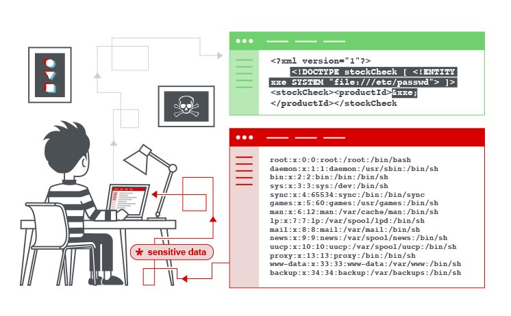
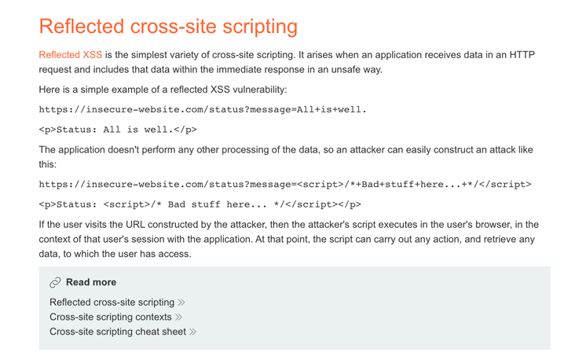
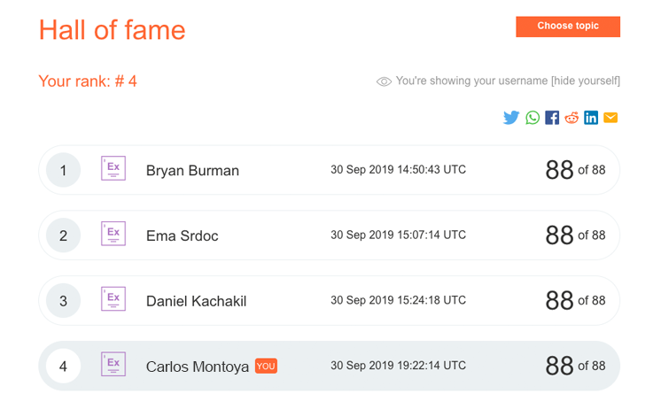
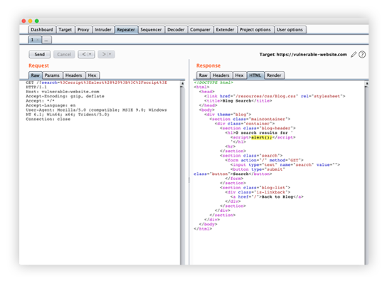
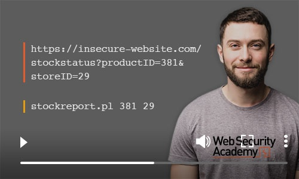
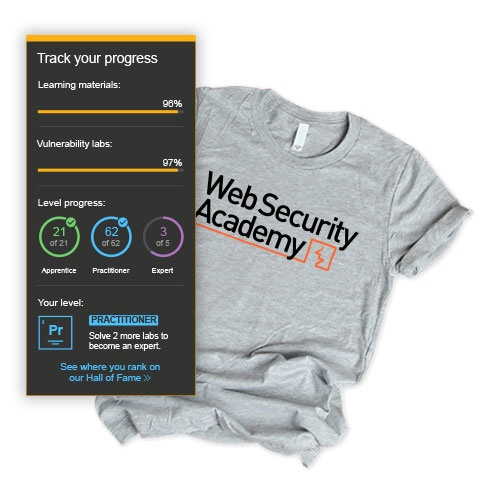

  
[Login](/users)  
Products Solutions [Research](/research) [Academy](/web-security) Support Company  
[Customers](/customers) [About](/about) [Blog](/blog) [Careers](/careers) [Legal](/legal) [Contact](/contact) [Resellers](/support/reseller-faqs)  
[My account](/users/youraccount) [Customers](/customers) [About](/about) [Blog](/blog) [Careers](/careers) [Legal](/legal) [Contact](/contact) [Resellers](/support/reseller-faqs)  
[ **Burp Suite DAST** The enterprise-enabled dynamic web vulnerability scanner. ](/burp/enterprise) [ **Burp Suite Professional** The world's #1 web penetration testing toolkit. ](/burp/pro) [ **Burp Suite Community Edition** The best manual tools to start web security testing. ](/burp/communitydownload) [View all product editions](/burp)  
[  
**Burp Scanner**  
Burp Suite's web vulnerability scanner ](/burp/vulnerability-scanner)  
[ **Attack surface visibility** Improve security posture, prioritize manual testing, free up time. ](/solutions/attack-surface-visibility) [ **CI-driven scanning** More proactive security - find and fix vulnerabilities earlier. ](/solutions/ci-driven-scanning) [ **Application security testing** See how our software enables the world to secure the web. ](/solutions) [ **DevSecOps** Catch critical bugs; ship more secure software, more quickly. ](/solutions/devsecops) [ **Penetration testing** Accelerate penetration testing - find more bugs, more quickly. ](/solutions/penetration-testing) [ **Automated scanning** Scale dynamic scanning. Reduce risk. Save time/money. ](/solutions/automated-security-testing) [ **Bug bounty hunting** Level up your hacking and earn more bug bounties. ](/solutions/bug-bounty-hunting) [ **Compliance** Enhance security monitoring to comply with confidence. ](/solutions/compliance)  
[View all solutions](/solutions)  
[  
**Product comparison**  
What's the difference between Pro and Enterprise Edition? ](/burp/enterprise/resources/enterprise-edition-vs-professional)  
[ **Support Center** Get help and advice from our experts on all things Burp. ](/support) [ **Documentation** Tutorials and guides for Burp Suite. ](/burp/documentation) [ **Get Started - Professional** Get started with Burp Suite Professional. ](/burp/documentation/desktop/getting-started) [ **Get Started - Enterprise** Get started with Burp Suite Enterprise Edition. ](/burp/documentation/enterprise/getting-started) [ **User Forum** Get your questions answered in the User Forum. ](https://forum.portswigger.net/) [ **Downloads** Download the latest version of Burp Suite. ](/burp/releases)  
[Visit the Support Center](/support)  
[  
**Downloads**  
Download the latest version of Burp Suite. ](/burp/releases)  
Academy home

1. [Dashboard](https://portswigger.net/web-security/index.html)
2. [Learning paths](https://portswigger.net/web-security/learning-paths)
3. Latest topics  
[Web cache deception](/web-security/web-cache-deception) [Web LLM attacks](/web-security/llm-attacks) [API testing](/web-security/api-testing) [NoSQL injection](/web-security/nosql-injection) [Race conditions](/web-security/race-conditions) [View all topics](/web-security/all-topics)  
4. All content  
[All labs](/web-security/all-labs) [All topics](/web-security/all-topics) [Mystery labs](/web-security/mystery-lab-challenge)  
5. Hall of Fame  
[Leaderboard](https://portswigger.net/web-security/hall-of-fame) [Interview - Kamil Vavra](https://portswigger.net/web-security/getting-started/kamil-vavra/index.html) [Interview - Johnny Villarreal](https://portswigger.net/web-security/getting-started/johnny-villarreal/index.html) [Interview - Andres Rauschecker](https://portswigger.net/web-security/getting-started/andres-rauschecker/index.html)  
6. [Get started](https://portswigger.net/web-security/getting-started/index.html)
7. Get certified  
[Get certified](https://portswigger.net/web-security/certification/index.html) [How to prepare](https://portswigger.net/web-security/certification/how-to-prepare/index.html) [How it works](https://portswigger.net/web-security/certification/how-it-works/index.html) [Practice exam](https://portswigger.net/web-security/certification/practice-exam/index.html) [Exam hints and guidance](https://portswigger.net/web-security/certification/exam-hints-and-guidance/index.html) [What the exam involves](https://portswigger.net/web-security/certification/how-it-works/index.html#what-the-exam-involves) [FAQs](https://portswigger.net/web-security/certification/frequently-asked-questions/index.html) [Validate your certification](https://portswigger.net/web-security/certification#validate-your-certification)  
  
  
# Free, online web security training from the creators of Burp Suite  
  
[Sign up](/users/register) [Login](/users)  
  
Boost your career  
The Web Security Academy is a strong step toward a career in cybersecurity.  
  
Flexible learning  
Learn anywhere, anytime, with free interactive labs and progress-tracking.  
  
Learn from experts  
Produced by a world-class team - led by the author of The Web Application Hacker's Handbook.  
  
## [New topic: Web cache deception   
Learn how to discover and exploit web cache deception vulnerabilities using new powerful techniques that exploit RFC ambiguities, bypassing the limitations of web cache deception attacks you may already be familiar with. Content and labs based on **Gotta cache em all: bending the rules of web cache exploitation** , first presented by PortSwigger Research at Black Hat USA 2024.   
Learn more ](/web-security/web-cache-deception)  
  
## Learning materials and labs  
  
Latest  
[  
Web cache deception  
5 labs ](/web-security/web-cache-deception) [  
Web LLM attacks  
4 labs ](/web-security/llm-attacks) [  
API testing  
5 labs ](/web-security/api-testing) [  
NoSQL injection  
4 labs ](/web-security/nosql-injection)  
Featured  
[  
SQL injection  
16 labs ](/web-security/sql-injection) [  
Cross-site scripting (XSS)  
30 labs ](/web-security/cross-site-scripting) [  
Cross-site request forgery (CSRF)  
8 labs ](/web-security/csrf) [  
XXE injection  
9 labs ](/web-security/xxe)  
[View all learning materials](/web-security/all-materials)[View all labs](/web-security/all-labs)  
  
## Up-to-the-minute learning resources  
  
The Web Security Academy is a free online training center for web application security. It includes content from PortSwigger's in-house research team, experienced academics, and our Chief Swig Dafydd Stuttard - author of [The Web Application Hacker's Handbook](/web-security/web-application-hackers-handbook).  
Unlike a textbook, the Academy is constantly updated. It also includes interactive labs where you can put what you learn to the test. If you want to improve your knowledge of hacking, or you'd like to become a bug bounty hunter or pentester, you're in the right place.  
 Learn about security vulnerabilities   
  
 Practice hacking like a professional   
  
 Test yourself in our interactive labs   
  
 Track your progress   
  
[Sign up](/users/register) [Login](/users)  
  
## Satisfy your curiosity - safely and legally  
  
We make Burp Suite - the leading software for web security testing. And we love our users (because they're the people who make Burp what it is). That's why we created the Web Security Academy. It's also why the Academy is 100% free.  
The Web Security Academy exists to help anyone who wants to learn about web security in a safe and legal manner. You can access everything (for free) and track your progress by [creating an account](https://portswigger.net/users/register). Please see the sidebar for more information.  
  
  
  
## Hack like the pros do  
  
Web security and ethical hacking are lucrative careers to get into, but they're often seen as dark and mysterious arts. The Web Security Academy smashes that stereotype. We make the latest application security knowledge available to everyone.  
Some of our interactive labs will, by their nature, require you to use tools to solve them. But fear not. If you don't have access to Burp Suite Professional, then Burp Suite Community Edition allows you to experiment for free. [Download Burp Suite here](https://portswigger.net/burp/communitydownload).  
  
## Web security training built for humans, not robots  
  
Let's face it, some of the online web application training out there can be a bit dull. And isn't hacking supposed to be fun? We certainly think so. That's why we've taken a fully interactive approach when it comes to the design of our web security training.  
While each topic in the Academy is fully explained in text, many also include video content to summarize key points. Then there are the interactive labs - realistic puzzles designed to test your skills as a hacker. These transfer directly over into real-life cybersecurity situations.  
  
  
  
## Track your progress, win cool swag  
  
Although we designed the labs to be fun, that doesn't necessarily mean they're easy (because where would be the fun in that, right?). We also love a bit of competition here at the Web Security Academy - and that's how we came up with the idea for the [Hall of Fame](https://portswigger.net/web-security/hall-of-fame).  
Every time we release a new lab, we'll announce it on [Twitter](https://twitter.com/WebSecAcademy). The first Web Security Academy users to solve the lab will win Burp Suite swag - as well as getting their name in the Hall of Fame for all to see. Of course, you can remain anonymous if you prefer.  
  
## All topics  
  
[SQL injection](/web-security/sql-injection) [XSS](/web-security/cross-site-scripting) [CSRF](/web-security/csrf) [Clickjacking](/web-security/clickjacking) [CORS](/web-security/cors) [XXE](/web-security/xxe) [SSRF](/web-security/ssrf) [Request smuggling](/web-security/request-smuggling) [Command injection](/web-security/os-command-injection) [Server-side template injection](/web-security/server-side-template-injection) [Insecure deserialization](/web-security/deserialization) [Path traversal](/web-security/file-path-traversal) [Access control](/web-security/access-control) [Authentication](/web-security/authentication) [OAuth authentication](/web-security/oauth) [Business logic vulnerabilities](/web-security/logic-flaws) [WebSockets](/web-security/websockets) [DOM-based](/web-security/dom-based) [Web cache poisoning](/web-security/web-cache-poisoning) [HTTP Host header attacks](/web-security/host-header) [Information disclosure](/web-security/information-disclosure) [File upload vulnerabilities](/web-security/file-upload) [JWT attacks](/web-security/jwt) [Essential skills](/web-security/essential-skills) [Prototype pollution](/web-security/prototype-pollution) [GraphQL API vulnerabilities](/web-security/graphql) [Race conditions](/web-security/race-conditions) [NoSQL injection](/web-security/nosql-injection) [API testing](/web-security/api-testing) [Web LLM attacks](/web-security/llm-attacks) [Web cache deception](/web-security/web-cache-deception) [Video guidelines](/web-security/video-guidelines) [Credits](/web-security/credits)  
[  
Getting started with the Web Security Academy  
Find out more ](/web-security/getting-started)  
[  
View all Web Security Academy topics  
Find out more ](/web-security/all-topics)  
[  
Track your progress in the Hall of Fame  
Find out more ](https://portswigger.net/web-security/hall-of-fame)  
Start learning now  
[Sign up](/users/register) [Login](/users)  
Burp Suite  
[Web vulnerability scanner](/burp/vulnerability-scanner) [Burp Suite Editions](/burp) [Release Notes](/burp/releases)  
Vulnerabilities  
[Cross-site scripting (XSS)](/web-security/cross-site-scripting) [SQL injection](/web-security/sql-injection) [Cross-site request forgery](/web-security/csrf) [XML external entity injection](/web-security/xxe) [Directory traversal](/web-security/file-path-traversal) [Server-side request forgery](/web-security/ssrf)  
Customers  
[Organizations](/organizations) [Testers](/testers) [Developers](/developers)  
Company  
[About](/about) [Careers](/careers) [Contact](/about/contact) [Legal](/legal) [Privacy Notice](/privacy)  
Insights  
[Web Security Academy](/web-security) [Blog](/blog) [Research](/research)  
 [ Follow us](https://twitter.com/Burp_Suite)  
© 2025 PortSwigger Ltd.  

