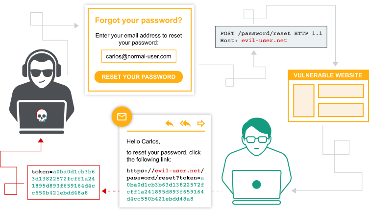

1. [Web Security Academy](/web-security)  
2. [Authentication vulnerabilities](/web-security/authentication)  
  
# Authentication vulnerabilities  
  
Conceptually, authentication vulnerabilities are easy to understand. However, they are usually critical because of the clear relationship between authentication and security.   
Authentication vulnerabilities can allow attackers to gain access to sensitive data and functionality. They also expose additional attack surface for further exploits. For this reason, it's important to learn how to identify and exploit authentication vulnerabilities, and how to bypass common protection measures.   
In this section, we explain:   
  
1. The most common authentication mechanisms used by websites. 
2. Potential vulnerabilities in these mechanisms. 
3. Inherent vulnerabilities in different authentication mechanisms. 
4. Typical vulnerabilities that are introduced by their improper implementation. 
5. How you can make your own authentication mechanisms as robust as possible. 

## Labs  
  
If you're familiar with the basic concepts behind authentication vulnerabilities and want to practice exploiting them on some realistic, deliberately vulnerable targets, you can access labs in this topic from the link below.   
  
1. [View all authentication labs](/web-security/all-labs#authentication)

## What is authentication?  
  
Authentication is the process of verifying the identity of a user or client. Websites are potentially exposed to anyone who is connected to the internet. This makes robust authentication mechanisms integral to effective web security.   
There are three main types of authentication:   
  
1. Something you **know** , such as a password or the answer to a security question. These are sometimes called "knowledge factors". 
2. Something you **have** , This is a physical object such as a mobile phone or security token. These are sometimes called "possession factors". 
3. Something you **are** or do. For example, your biometrics or patterns of behavior. These are sometimes called "inherence factors".   
Authentication mechanisms rely on a range of technologies to verify one or more of these factors.   
  
### What is the difference between authentication and authorization?  
  
Authentication is the process of verifying that a user is who they claim to be. Authorization involves verifying whether a user is allowed to do something.   
For example, authentication determines whether someone attempting to access a website with the username `Carlos123` really is the same person who created the account.   
Once `Carlos123` is authenticated, their permissions determine what they are authorized to do. For example, they may be authorized to access personal information about other users, or perform actions such as deleting another user's account.   
  
## How do authentication vulnerabilities arise?  
  
Most vulnerabilities in authentication mechanisms occur in one of two ways:   
  
1. The authentication mechanisms are weak because they fail to adequately protect against brute-force attacks. 
2. Logic flaws or poor coding in the implementation allow the authentication mechanisms to be bypassed entirely by an attacker. This is sometimes called "broken authentication".   
In many areas of web development, logic flaws cause the website to behave unexpectedly, which may or may not be a security issue. However, as authentication is so critical to security, it's very likely that flawed authentication logic exposes the website to security issues.   
  
## What is the impact of vulnerable authentication?  
  
The impact of authentication vulnerabilities can be severe. If an attacker bypasses authentication or brute-forces their way into another user's account, they have access to all the data and functionality that the compromised account has. If they are able to compromise a high-privileged account, such as a system administrator, they could take full control over the entire application and potentially gain access to internal infrastructure.   
Even compromising a low-privileged account might still grant an attacker access to data that they otherwise shouldn't have, such as commercially sensitive business information. Even if the account does not have access to any sensitive data, it might still allow the attacker to access additional pages, which provide a further attack surface. Often, high-severity attacks are not possible from publicly accessible pages, but they may be possible from an internal page.   
  
## Vulnerabilities in authentication mechanisms  
  
A website's authentication system usually consists of several distinct mechanisms where vulnerabilities may occur. Some vulnerabilities are applicable across all of these contexts. Others are more specific to the functionality provided.   
We will look more closely at some of the most common vulnerabilities in the following areas:   
  
1. [Vulnerabilities in password-based login](/web-security/authentication/password-based) LABS
2. [Vulnerabilities in multi-factor authentication](/web-security/authentication/multi-factor) LABS
3. [Vulnerabilities in other authentication mechanisms](/web-security/authentication/other-mechanisms) LABS  
Several of the labs require you to enumerate usernames and brute-force passwords. To help you with this process, we provide a shortlist of candidate [usernames](/web-security/authentication/auth-lab-usernames) and [passwords](/web-security/authentication/auth-lab-passwords) that you should use to solve the labs.   
  
### Vulnerabilities in third-party authentication mechanisms  
  
If you love to hack authentication mechanisms and you've completed our main authentication, you may want to try our OAuth authentication labs.   
  
#### Read more  
  
[OAuth authentication](/web-security/oauth)  
  
## Preventing attacks on your own authentication mechanisms  
  
We have demonstrated several ways in which websites can be vulnerable due to how they implement authentication. To reduce the risk of such attacks on your own websites, there are several principles that you should always try to follow.   
  
#### Read more

1. [How to secure your authentication mechanisms](/web-security/authentication/securing)
