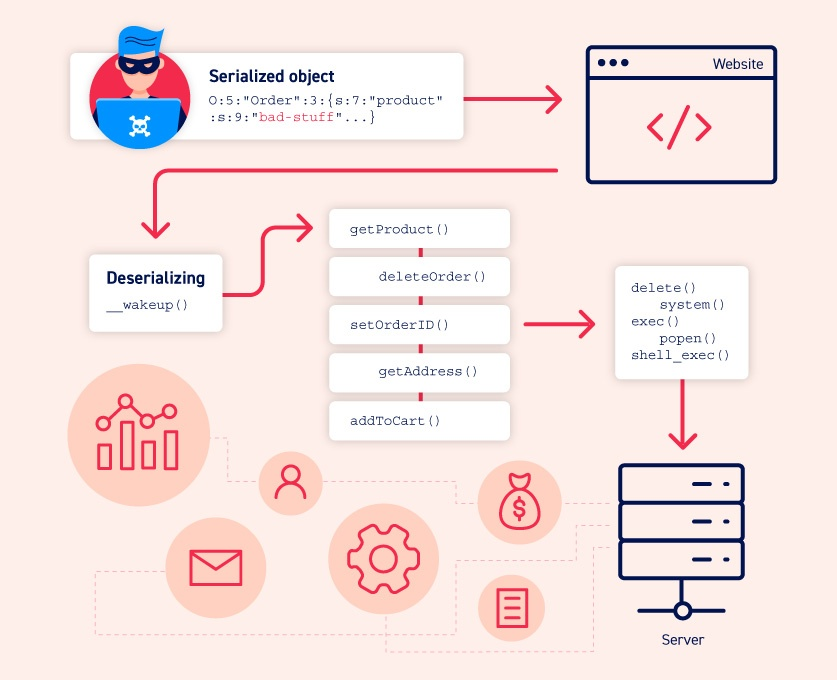
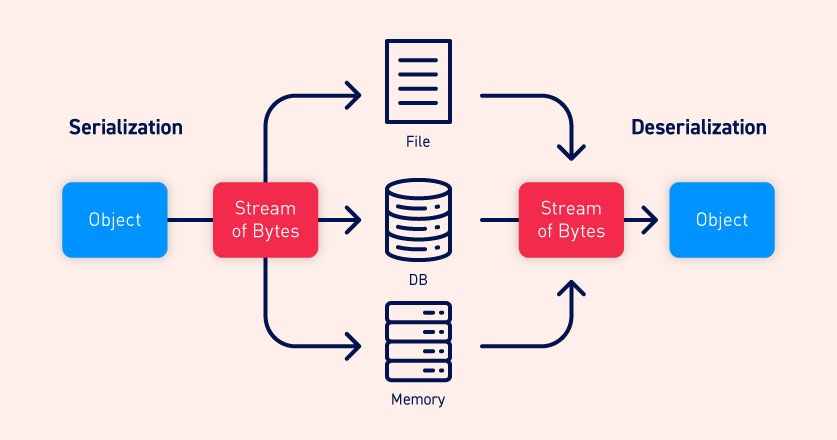

1. [Web Security Academy](/web-security)  
2. [Insecure deserialization](/web-security/deserialization)  
  
# Insecure deserialization  
  
In this section, we'll cover what insecure deserialization is and describe how it can potentially expose websites to high-severity attacks. We'll highlight typical scenarios and demonstrate some widely applicable techniques using concrete examples of PHP, Ruby, and Java deserialization. We'll also look at some ways that you can avoid insecure deserialization vulnerabilities in your own websites.   
  
  
#### Labs  
  
If you're already familiar with the basic concepts behind deserialization vulnerabilities and just want to practice exploiting them on some realistic, deliberately vulnerable targets, you can access all of the labs in this topic from the link below.   
  
1. [View all deserialization labs](/web-security/all-labs#insecure-deserialization)  
  
## What is serialization?  
  
**Serialization** is the process of converting complex data structures, such as objects and their fields, into a "flatter" format that can be sent and received as a sequential stream of bytes. Serializing data makes it much simpler to:   
  
1. Write complex data to inter-process memory, a file, or a database 
2. Send complex data, for example, over a network, between different components of an application, or in an API call   
Crucially, when serializing an object, its state is also persisted. In other words, the object's attributes are preserved, along with their assigned values.   
  
### Serialization vs deserialization  
  
**Deserialization** is the process of restoring this byte stream to a fully functional replica of the original object, in the exact state as when it was serialized. The website's logic can then interact with this deserialized object, just like it would with any other object.   
  
Many programming languages offer native support for serialization. Exactly how objects are serialized depends on the language. Some languages serialize objects into binary formats, whereas others use different string formats, with varying degrees of human readability. Note that all of the original object's attributes are stored in the serialized data stream, including any private fields. To prevent a field from being serialized, it must be explicitly marked as "transient" in the class declaration.   
Be aware that when working with different programming languages, serialization may be referred to as marshalling (Ruby) or pickling (Python). These terms are synonymous with "serialization" in this context.   
  
## What is insecure deserialization?  
  
Insecure deserialization is when user-controllable data is deserialized by a website. This potentially enables an attacker to manipulate serialized objects in order to pass harmful data into the application code.   
It is even possible to replace a serialized object with an object of an entirely different class. Alarmingly, objects of any class that is available to the website will be deserialized and instantiated, regardless of which class was expected. For this reason, insecure deserialization is sometimes known as an "object injection" vulnerability.   
An object of an unexpected class might cause an exception. By this time, however, the damage may already be done. Many deserialization-based attacks are completed **before** deserialization is finished. This means that the deserialization process itself can initiate an attack, even if the website's own functionality does not directly interact with the malicious object. For this reason, websites whose logic is based on strongly typed languages can also be vulnerable to these techniques.   
  
## How do insecure deserialization vulnerabilities arise?  
  
Insecure deserialization typically arises because there is a general lack of understanding of how dangerous deserializing user-controllable data can be. Ideally, user input should never be deserialized at all.   
However, sometimes website owners think they are safe because they implement some form of additional check on the deserialized data. This approach is often ineffective because it is virtually impossible to implement validation or sanitization to account for every eventuality. These checks are also fundamentally flawed as they rely on checking the data after it has been deserialized, which in many cases will be too late to prevent the attack.   
Vulnerabilities may also arise because deserialized objects are often assumed to be trustworthy. Especially when using languages with a binary serialization format, developers might think that users cannot read or manipulate the data effectively. However, while it may require more effort, it is just as possible for an attacker to exploit binary serialized objects as it is to exploit string-based formats.   
Deserialization-based attacks are also made possible due to the number of dependencies that exist in modern websites. A typical site might implement many different libraries, which each have their own dependencies as well. This creates a massive pool of classes and methods that is difficult to manage securely. As an attacker can create instances of any of these classes, it is hard to predict which methods can be invoked on the malicious data. This is especially true if an attacker is able to chain together a long series of unexpected method invocations, passing data into a sink that is completely unrelated to the initial source. It is, therefore, almost impossible to anticipate the flow of malicious data and plug every potential hole.   
In short, it can be argued that it is not possible to securely deserialize untrusted input.   
  
## What is the impact of insecure deserialization?  
  
The impact of insecure deserialization can be very severe because it provides an entry point to a massively increased attack surface. It allows an attacker to reuse existing application code in harmful ways, resulting in numerous other vulnerabilities, often remote code execution.   
Even in cases where remote code execution is not possible, insecure deserialization can lead to privilege escalation, arbitrary file access, and denial-of-service attacks.   
  
## How to exploit insecure deserialization vulnerabilities  
  
Now that you're familiar with the basics of serialization and deserialization, we can look at how you can exploit insecure deserialization vulnerabilities.   
  
#### Read more

1. [Exploiting insecure deserialization vulnerabilities](/web-security/deserialization/exploiting)  
  
## How to prevent insecure deserialization vulnerabilities  
  
Generally speaking, deserialization of user input should be avoided unless absolutely necessary. The high severity of exploits that it potentially enables, and the difficulty in protecting against them, outweigh the benefits in many cases.   
If you do need to deserialize data from untrusted sources, incorporate robust measures to make sure that the data has not been tampered with. For example, you could implement a digital signature to check the integrity of the data. However, remember that any checks must take place **before** beginning the deserialization process. Otherwise, they are of little use.   
If possible, you should avoid using generic deserialization features altogether. Serialized data from these methods contains all attributes of the original object, including private fields that potentially contain sensitive information. Instead, you could create your own class-specific serialization methods so that you can at least control which fields are exposed.   
Finally, remember that the vulnerability is the deserialization of user input, not the presence of gadget chains that subsequently handle the data. Don't rely on trying to eliminate gadget chains that you identify during testing. It is impractical to try and plug them all due to the web of cross-library dependencies that almost certainly exist on your website. At any given time, publicly documented memory corruption exploits are also a factor, meaning that your application may be vulnerable regardless. 
